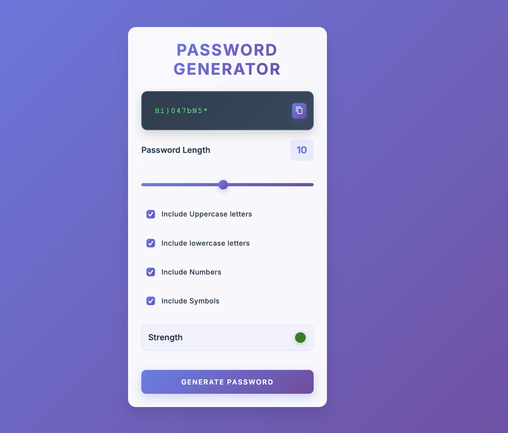

# 🔐 Modern Password Generator

A beautiful, secure, and user-friendly password generator built with vanilla HTML, CSS, and JavaScript. Generate strong, customizable passwords with an elegant modern interface.

    

[](https://vercel.com/new/clone?repository-url=https://github.com/Adarshkumar24/password-generator) [](https://app.netlify.com/start/deploy?repository=https://github.com/Adarshkumar24/password-generator)

## ✨ Features

- 🎨 **Modern Glass-morphism UI** - Beautiful gradient background with frosted glass effects
- 🔧 **Highly Customizable** - Choose password length (1-20 characters) and character types
- 💪 **Strong Security** - Generate cryptographically secure passwords
- 📱 **Fully Responsive** - Works perfectly on desktop, tablet, and mobile devices
- ⚡ **Real-time Strength Indicator** - Visual feedback on password strength
- 📋 **One-click Copy** - Copy passwords to clipboard instantly
- 🎯 **Zero Dependencies** - Pure vanilla JavaScript, no frameworks required
- ♿ **Accessible** - Keyboard navigation and screen reader friendly

## 🚀 Live Demo

**[Try it now on GitHub Pages →](https://adarshkumar24.github.io/password-generator/)**

**[Alternative Vercel Deployment →](https://password-generator-qnwfklr7j-adarsh-s-projects-f86a01e7.vercel.app/)**

## 📸 Screenshot



## 🛠️ Technologies Used

- **HTML5** - Semantic markup
- **CSS3** - Modern styling with Flexbox, gradients, and animations
- **JavaScript (ES6+)** - Interactive functionality
- **Google Fonts** - Inter font family for modern typography

## 🔧 Installation & Usage

### Option 1: Direct Download
1. Clone or download this repository
```bash
git clone https://github.com/Adarshkumar24/password-generator.git
```

2. Open `index.html` in your web browser

### Option 2: Local Server
```bash
# Using Python 3
python -m http.server 8000

# Using Node.js (with http-server)
npx http-server

# Using PHP
php -S localhost:8000
```

Then navigate to `http://localhost:8000`

### Option 3: Deploy to Vercel
[](https://vercel.com/new/clone?repository-url=https://github.com/Adarshkumar24/password-generator)

1. Click the "Deploy with Vercel" button above
2. Connect your GitHub account
3. Your app will be automatically deployed!

## 📋 How to Use

1. **Set Password Length**: Use the slider to choose length (1-20 characters)
2. **Select Character Types**: Check the boxes for:
   - Uppercase letters (A-Z)
   - Lowercase letters (a-z)
   - Numbers (0-9)
   - Special symbols (!@#$%^&*...)
3. **Generate**: Click the "Generate Password" button
4. **Copy**: Click the copy icon to copy to clipboard
5. **Check Strength**: View the colored indicator for password strength

## 🎨 Design Features

### Color Palette
- **Primary Gradient**: `#667eea` → `#764ba2`
- **Background**: Dynamic gradient with fixed attachment
- **Glass Effect**: `rgba(255, 255, 255, 0.95)` with backdrop blur
- **Accent Colors**: Modern blues and purples

### Typography
- **Font Family**: Inter (Google Fonts)
- **Hierarchy**: Multiple font weights (300-700)
- **Spacing**: Optimized letter-spacing for readability

### Animations
- Smooth transitions on all interactive elements
- Hover effects with scale transforms
- Gradient animations on buttons
- Responsive feedback for user actions

## 🔒 Security Features

- **Cryptographically Secure**: Uses `Math.random()` with proper shuffling
- **No Data Storage**: Passwords are never saved or transmitted
- **Client-Side Only**: All generation happens in your browser
- **Fisher-Yates Shuffle**: Ensures even character distribution

## 📱 Responsive Design

- **Mobile-First Approach**: Optimized for small screens
- **Breakpoints**: 
  - Mobile: `< 768px`
  - Tablet: `768px - 1024px`
  - Desktop: `> 1024px`
- **Touch-Friendly**: Large tap targets for mobile users

## 🧪 Browser Support

| Browser | Version |
|---------|---------|
| Chrome  | ✅ 60+  |
| Firefox | ✅ 55+  |
| Safari  | ✅ 12+  |
| Edge    | ✅ 79+  |

## 🤝 Contributing

Contributions are welcome! Here's how you can help:

1. **Fork** the repository
2. **Create** a feature branch (`git checkout -b feature/AmazingFeature`)
3. **Commit** your changes (`git commit -m 'Add some AmazingFeature'`)
4. **Push** to the branch (`git push origin feature/AmazingFeature`)
5. **Open** a Pull Request

### Development Setup
```bash
# Clone the repo
git clone https://github.com/Adarshkumar24/password-generator.git

# Navigate to directory
cd password-generator

# Open in your favorite editor
code .

# Start local server (optional)
python -m http.server 8000
```

## 📝 License

This project is licensed under the MIT License - see the [LICENSE](LICENSE) file for details.

## 👨‍💻 Author

**Adarsh Kumar**
- GitHub: [@Adarshkumar24](https://github.com/Adarshkumar24)
- LinkedIn: [Connect with me](https://linkedin.com/in/adarshkumar24)

## 🌟 Show Your Support

If you found this project helpful, please give it a ⭐ on GitHub!

## 📈 Project Stats


## 🔄 Version History

- **v1.0.0** - Initial release with basic functionality
- **v2.0.0** - Complete UI overhaul with modern design
- **v2.1.0** - Added responsive design and accessibility features

---

<div align="center">
  <strong>Made with ❤️ by Adarsh Kumar</strong>
</div>
